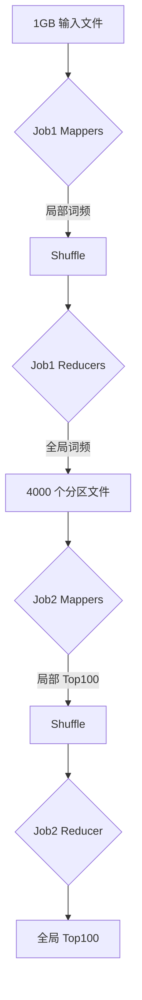

# TOP 100 freq words

## 问题

问题：有一个 1G 大小的文件，里面每一行是一个词，每个词的大小不超过 16 字节，内存限制大小是 1M。返回出现频率最高的 100 个单词

## 思路

### 问题分析

- 有一个 1GB 的文件，每行是一个词，每个词不超过 16 字节。
- 内存限制为 1MB，因此无法一次性加载整个文件到内存中处理。
- 需要返回出现频率最高的 100 个词，要求精确结果（非近似）。
- 核心挑战：内存小，文件大，需高效处理大数据，避免内存溢出。

### 解决思路：分治法 + 外部排序 + 堆维护 Top 100

使用分治法将大文件分解为小文件块，每个块在内存中处理，然后多级合并部分结果。在合并过程中，维护一个最小堆来跟踪全局频率最高的 100 个词。思路简单直接，步骤如下：

1. **分块（Divide）**：
   - 将大文件分割成多个小文件块，每个块大小约 500KB（约 32,000 行），确保块内不同词的数量不超过内存限制（1MB）。
     - 为什么 500KB？内存 1MB，每个词最大 16 字节，哈希表条目（词 + 频率）约 20-32 字节（包括开销），32,000 个不同词需约 640KB，小于 1MB。
   - 分割方法：顺序读取大文件，逐行写入块文件，直到块大小达到约 500KB。重复直到处理完整个文件。
   - 块数量：文件 1GB ≈ 1,000,000,000 字节，每行平均约 10 字节（词 + 换行符），总行数约 100,000,000 行。每个块 32,000 行，块数约 3,125（100,000,000 / 32,000 ≈ 3,125）。
2. **块内处理（Process Chunks）**：
   - 对每个块文件：
     - 读入内存（约 500KB）。
     - 使用哈希表统计词频：逐行读取，以词为键，累加频率。
     - 块处理完后，对哈希表中的词按键（词）排序。
     - 输出到临时文件：每行格式为 "词 频率"，并按词排序（便于后续合并）。
   - 内存使用：哈希表存储词（最大 16 字节）和频率（4 字节整数），条目上限 32,000，总内存约 640KB，满足 1MB 限制。
   - 输出：每个块生成一个排序后的部分频率文件。
3. **第一级合并（Merge Partially）**：
   - 部分文件数量多（约 3,125 个），需分组合并，避免同时打开太多文件（文件描述符限制，假设一次最多打开 256 个文件）。
   - 分组：将约 3,125 个部分文件分成 13 组（每组 240 文件）和 1 组（剩余文件），确保每组文件数 ≤ 256。
   - 对每组执行多路合并：
     - 使用优先队列（最小堆）按键（词）合并：堆中每个条目存储（词、频率、文件索引），大小约 30 字节。
     - 合并逻辑：弹出最小词，检查所有输入文件是否有相同词，累加频率，输出全局（词，聚合频率）到新临时文件（按词排序）。
     - 内存使用：优先队列（256 条目 × 30 字节 ≈ 7.7KB），输入缓冲区（每个文件 512 字节缓冲区 × 256 文件 ≈ 128KB），输出缓冲区（4KB），总内存约 140KB < 1MB。
   - 输出：每组生成一个更大的排序频率文件（约 13 个文件）。
4. **第二级合并与 Top 100 提取（Final Merge and Heap Update）**：
   - 第一级合并后，文件数少（约 13 个），可一次性合并。
   - 执行多路合并（13 路）：
     - 使用优先队列按键（词）合并：堆中每个条目约 30 字节。
     - 合并逻辑：弹出最小词，累加所有输入文件中的频率，得到全局（词，全局频率）。
     - 同时维护一个最小堆（大小 100）用于 Top 100：以频率为键，存储（词，频率）。
       - 对于每个全局（词，频率），插入堆中。
       - 如果堆大小 > 100，弹出最小频率条目，确保堆始终保留最大频率的 100 个词。
     - 内存使用：优先队列（13 条目 × 30 字节 ≈ 0.4KB），输入缓冲区（13 文件 × 4KB = 52KB），堆（100 条目 × 30 字节 ≈ 3KB），总内存约 55KB < 1MB。
     - 注意：无需输出完整全局文件，只更新堆，节省内存和磁盘。
   - 处理完所有词后，堆中即为频率最高的 100 个词。
5. **输出结果**：
   - 堆中元素按频率最小堆组织，但 Top 100 已确定。
   - 将堆中元素按频率降序排序（例如，通过逐个弹出并反转），返回结果。

### 为什么满足内存限制？

- 分块大小（500KB）确保块内处理在 1MB 内。
- 合并阶段使用小缓冲区（每个文件 512 字节-4KB）和紧凑数据结构（优先队列条目 30 字节），总内存始终 < 1MB。
- 堆维护 Top 100 仅需约 3KB，不影响内存。

### 优点

- 简单直接：分治减少内存压力，外部排序处理大数据，堆高效维护 Top K。
- 精确结果：通过全局频率累加，确保正确性。
- 可扩展：适用于更大文件或更小内存。

此思路可在标准编程语言（如 Python、Java）中实现，注意文件 I/O 和缓冲区管理以优化性能。

## 解法一

第一步：将 1 G 拆分成小文件，每个小文件的大小不超过 1 MB ，其实应该留空间用于统计一个小文件中单词出现的频率，所以为了保险起见，每个文件的大小不超过 512 kb，那么得到 1 GB / 512 KB = 2048 个小文件

这里不用 hash 的方法来切分小文件，直接顺序读取然后写到小文件，小文件大小多到了 512kb 就关闭，写下一个小文件

第二步：分别对每个文件做下面的事情：
① 将小文件中的单词加载进内存
② 使用 HashMap 进行单词统计
③ 将 HashMap 中词频数据写到另一个新的小文件中，我们称为词频小文件
这里再写的时候，对单词进行 hash (word) % 2048 写到对应的文件中
这样做的目的是为了相同的单词放到同一个文件中。

第三步：初始化一个 100 个节点的小顶堆，用于保存 100 个出现频率最多的单词
分别对每个词频小文件做下面的事情：
① 将小文件中的单词及其频率加载进内存
② 使用 HashMap 进行单词统计
③ 遍历 HashMap 中单词词频，如果词频大于小顶堆中堆顶词频的话，则放入小顶堆，否则不放

最终，小顶堆中的 100 个单词就是出现频率最多的单词了

该方案在第二步的第 ③ 点的时候有点问题：就是当词频小文件大于 1 M 了，该怎么处理呢？
或者说极端情况下，每个单词都只出现一次，并且每个单词的 hash (word) % 2048 值都是相同的话，那词频小文件的大小都会超过 1 G 了

## 解法二

第一步：使用多路归并排序对大文件进行排序，这样相同的单词肯定是挨着的

第二步：
① 初始化一个 100 个节点的小顶堆，用于保存 100 个出现频率最多的单词
② 遍历整个文件，一个单词一个单词的从文件中取出来，并计数
③ 等到遍历的单词和上一个单词不同的话，那么上一个单词及其频率如果大于堆顶的词的频率，那么放在堆中，否则不放

最终，小顶堆中就是出现频率前 100 的单词了

多路归并排序对大文件进行排序的步骤如下：
① 将文件按照顺序切分成大小不超过 512KB 的小文件，总共 2048 个小文件
② 使用 1MB 内存分别对 2048 个小文件中的单词进行排序
③ 使用一个大小为 2048 大小的堆，对 2048 个小文件进行多路排序，结果写到一个大文件中


## 代码实现

### 数据准备和工具类


```java
public class FileIOUtils {

    // 拿到指定文件的输入流，并包装成文件 BufferedReader
    public static BufferedReader getReader(String name) {
        try {
            FileInputStream inputStream = new FileInputStream(name);
            BufferedReader br = new BufferedReader(new InputStreamReader(inputStream));
            return br;
        } catch (IOException e) {
            throw new RuntimeException("IOException", e);
        }
    }

    // 拿到指定文件的输出流，并包装成文件 BufferedWriter
    public static BufferedWriter getWriter(String name) {
        try {
            FileOutputStream outputStream = new FileOutputStream(name);
            BufferedWriter bw = new BufferedWriter(new OutputStreamWriter(outputStream));
            return bw;
        } catch (IOException e) {
            throw new RuntimeException("IOException", e);
        }
    }

    public static void closeReader(Reader reader) {
        try {
            if (reader != null) {
                reader.close();
            }
        } catch (IOException e) {
            throw new RuntimeException("IOException", e);
        }
    }

    public static void closeWriter(Writer writer) {
        try {
            if (writer != null) {
                writer.close();
            }
        } catch (IOException e) {
            throw new RuntimeException("IOException", e);
        }
    }
}
```


```java
/**
 * 准备阶段：准备 1G 的文件，文件中每一行一个单词，每个单词的大小小于等于 16 字节
 * 数据写道当前工程目录下的文件：data\top100\words.txt
 */
public class _0_WordsGenerator {
    private static Random r = new Random();

    public static void main(String[] args) throws IOException {

        BufferedWriter writer = FileIOUtils.getWriter("data\\top100\\words.txt");

        char[] chars = {'a', 'b', 'c', 'd', 'e', 'f', 'g'};
        int m = chars.length;

        for (int i = 0; i < 10000; i++) {
            StringBuilder line = new StringBuilder();
            for (int j = 0; j < r.nextInt(16); j++) {
                line.append(chars[r.nextInt(m)]);
            }
            if (line.length() == 0) continue;
            writer.write(line.toString());
            writer.newLine();
        }

        FileIOUtils.closeWriter(writer);
    }
}
```

### 将一个大文件切割成多个小文件

```java
/**
 * 第一步：将一个大文件切割成多个小文件
 * 小文件的大小为 512kb 左右
 * 小文件都写到这个目录下：data\top100\raw_data\
 */
public class _1_FileSplit {

    public void splitFile(String fileName) throws IOException {
        int fileNum = 0;
        String fileSuffix = "data\\top100\\raw_data\\";
        String littleFileName = fileSuffix + fileNum;

        // 记录每个小文件的大小
        long totalSize = 0;

        BufferedWriter bw = FileIOUtils.getWriter(littleFileName);

        BufferedReader br = FileIOUtils.getReader(fileName);
        String line = null;
        while ((line = br.readLine()) != null) {
            // 如果当前小文件大小大于 512KB ，那么关闭当前小文件，写下一个小文件
            if (totalSize >= 512 * 1024) {
                // 关闭当前小文件的输出流
                FileIOUtils.closeWriter(bw);

                // 拿到下一个小文件的输出流，开始写下一个小文件
                fileNum++;
                littleFileName = fileSuffix + fileNum;
                bw = FileIOUtils.getWriter(littleFileName);
                totalSize = 0;
            }

            totalSize += line.length();

            bw.write(line);
            bw.newLine();
        }

        FileIOUtils.closeReader(br);
    }

    public static void main(String[] args) throws IOException {
        String fileName = "data\\top100\\words.txt";
        new _1_FileSplit().splitFile(fileName);
    }
}

```


### 每个小文件中的单词进行排序

```java
/**
 * 第二步：将每个小文件中的单词进行排序
 *  排序后的数据写到另一个目录：data\top100\sorted_data\
 */
public class _2_LittleFileSorter {

    public void sortEachFile(String dirName) throws IOException {
        File dir = new File(dirName);
        File[] littleFiles = dir.listFiles();

        // 排序每一个小文件中的单词
        for (int i = 0; i < littleFiles.length; i++) {
            // 1. 将当前小文件中单词读取到内存中
            BufferedReader br = FileIOUtils.getReader(littleFiles[i].getName());
            List<String> words = new ArrayList<>();
            String line = null;
            while ((line = br.readLine()) != null) {
                words.add(line);
            }

            FileIOUtils.closeReader(br);

            // 2. 对当前文件中的所有单词进行排序
            Collections.sort(words);

            // 3. 将排完序的单词写道目标文件中
            BufferedWriter bw = FileIOUtils.getWriter("data\\top100\\sorted_data\\" + i);
            for (String word : words) {
                bw.write(word);
                bw.newLine();
            }
            FileIOUtils.closeWriter(bw);
        }

    }

    public static void main(String[] args) throws IOException {
        String dir = "data\\top100\\raw_data";
        new _2_LittleFileSorter().sortEachFile(dir);
    }

}


```

### 对有序的小文件进行外部排序

我们先写一个 BufferedIterator 类，如下：

```java
// BufferedIterator 是对文件输入流 BufferedReader 的包装，用于：
//  ① 判断输入流中是否还有数据，有过有的话，则先缓存下一行数据
//  ② 得到文件输入流中的下一行数据
public class BufferedIterator {

    private BufferedReader reader;
    private String head;

    BufferedIterator(BufferedReader reader) {
        this.reader = reader;
    }

    public boolean hasNext() {
        try {
            head = this.reader.readLine();
        } catch (IOException e) {
            e.printStackTrace();
            head = null;
        }
        return head != null;
    }

    public String next() {
        return head;
    }

    public void close() throws Exception {
        this.reader.close();
    }
}


```

然后使用多路归并排序来实现文件的外部排序，如下代码：

```java
/**
 * 第三步： 对有序的小文件进行外部排序
 * 使用多路归并排序实现
 */
public class _3_ExternalSorter {

    public void mergeSort(String dirName) throws Exception {

        File dir = new File(dirName);
        File[] children = dir.listFiles();

        // 1. 初始化一个最小堆，大小就是有序小文件的个数
        // 堆中的每个节点存放每个有序小文件对应的输入流
        // BufferedIterator 是对文件输入流 BufferedReader 的包装，用于：
        //  ① 判断输入流中是否还有数据
        //  ② 得到文件输入流中的下一行数据
        PriorityQueue<BufferedIterator> minHeap = new PriorityQueue<>(children.length, new Comparator<BufferedIterator>() {
            @Override
            public int compare(BufferedIterator o1, BufferedIterator o2) {
                // 按照每个有序文件中的下一行数据对所有文件输入流进行排序
                // 单词小的输入文件流放在堆顶
                return o1.next().compareTo(o2.next());
            }
        });

        // 2. 将所有有序文件的输入流包装成 BufferedIterator 放入到堆中
        for (File file : children) {
            BufferedReader br = FileIOUtils.getReader(file.getName());
            BufferedIterator buf = new BufferedIterator(br);
            // 要有数据才放入到堆中，否则关闭流
            if (buf.hasNext()) {
                minHeap.add(buf);
            } else {
                buf.close();
            }
        }

        BufferedWriter bw = FileIOUtils.getWriter("data\\top100\\sorted_words.txt");
        // 3. 拿出堆顶的数据，并写入到最终排序的文件中
        while (!minHeap.isEmpty()) {
            BufferedIterator firstBuf = minHeap.poll();
            bw.write(firstBuf.next());
            bw.newLine();
            // 如果拿出来的输入流中还有数据的话，那么将这个输入流再一次添加到栈中，
            if (firstBuf.hasNext()) {
                minHeap.add(firstBuf);
            } else { // 否则说明该文件输入流中没有数据了，那么可以关闭这个流
                firstBuf.close();
            }
        }

       FileIOUtils.closeWriter(bw);
    }

    public static void main(String[] args) throws Exception {
        String dirName = "data\\top100\\sorted_data\\";
        new _3_ExternalSorter().mergeSort(dirName);
    }

}


```

### 利用 100 大小的小顶堆得到出现频率 top 100 的单词

```java
/**
 * 第四步：利用 100 大小的小顶堆得到出现频率 top 100 的单词
 * 到这里，经过外部排序后，文件中所有的单词都是有序的，相同的单词都是挨着的
 * 所以，可以顺序遍历有序的文件，得到出现频率 top 100 的单词
 */
public class _4_Top_100_Words {

    class Pair {
        String word;
        int cnt;

        Pair(String word, int cnt) {
            this.word = word;
            this.cnt = cnt;
        }
    }

    public String[] top_100 (String fileName) throws Exception {

        // 1. 初始化一个 100 大小的小顶堆
        // 堆中每个节点存放的是单词及其出现的次数
        PriorityQueue<Pair> minHeap = new PriorityQueue<>(100, new Comparator<Pair>() {
            @Override
            public int compare(Pair o1, Pair o2) {
                // 按照单词出现的次数排序
                // 出现次数多的，放在堆顶
                return o1.cnt - o2.cnt;
            }
        });


        // 前一个单词
        String prevWord = null;
        // 前一个单词出现的次数
        int prevCnt = 0;

        BufferedReader br = FileIOUtils.getReader(fileName);
        // 当前的单词
        String currWord = null;
        // 2. 读取有序文件中每一行的单词，然后统计其出现的次数，并保留出现次数 top 100 的单词
        while ((currWord = br.readLine()) != null) {
            // 如果当前的单词和前一个单词不是同一个单词
            // 那么需要处理前一个单词
            if (!currWord.equals(prevWord)) {
                // 如果堆的大小小于 100，那么直接将前一个单词及其出现的次数放入堆中
                if (minHeap.size() < 100) {
                    minHeap.add(new Pair(prevWord, prevCnt));
                } else if (prevCnt > minHeap.peek().cnt) { // 否则，如果前一个单词出现的次数大于堆顶单词出现的次数
                    // 先删除堆顶单词
                    minHeap.remove();
                    //将前一个单词及其出现的次数放入堆中
                    minHeap.add(new Pair(prevWord, prevCnt));
                }

                // 将当前单词设置为前一个单词
                prevWord = currWord;
                // 前一个单词出现的次数清零
                prevCnt = 0;
            }
            // 统计前一个单词出现的次数
            prevCnt++;
        }

        //3. 最终堆中的 100 个单词就是出现频率最高的单词了，输出即可
        String[] res = new String[100];
        int index = 0;
        while (!minHeap.isEmpty()) {
            res[index++] = minHeap.poll().word;
        }

        return res;
    }

    public static void main(String[] args) throws Exception {
        String fileName = "data\\top100\\sorted_words.txt";
        String[] res = new _4_Top_100_Words().top_100(fileName);
        System.out.println(Arrays.toString(res));
    }

}
```

## MapReduce 框架 Hadoop Spark

### MapReduce 思路解决大文件词频统计与 Top 100 问题

#### 核心思想

MapReduce 是分布式计算模型，天然适合处理海量数据。我们将问题分解为两个 MapReduce 作业：

1. **词频统计作业**：精确计算每个词的全局频率
2. **Top 100 提取作业**：从全局词频中筛选最高频词

#### 系统架构

```
输入文件 (1GB)
     │
     ├─ MapReduce Job 1 (词频统计)
     │    ├─ Mapper 局部词频统计
     │    └─ Reducer 全局词频合并
     │
     └─ MapReduce Job 2 (Top 100 提取)
          ├─ Mapper 局部 Top 100 筛选
          └─ Reducer 全局 Top 100 合并
```

### **Job 1: 全局词频统计**

**目标**：精确计算每个词的出现频率

#### Map 阶段

- **输入**：文件分块（每块 ≈500KB）

```python
def mapper(block):
    word_count = {}
    for word in block:
        word_count[word] = word_count.get(word, 0) + 1
    
    # 输出当前块的词频统计
    for word, count in word_count.items():
        yield (word, count)
```

- **内存控制**：每个 Mapper 处理单块（500KB），哈希表内存 ≈700KB < 1MB
- **输出示例**：`(apple, 15)`, `(banana, 23)`, ...

#### Shuffle 阶段

- 按单词哈希分区（如 `hash(word) % R`）
- 相同单词的计数发送到同一 Reducer

#### Reduce 阶段

- **输入**：相同单词的所有局部计数 `[ (word, [count1, count2,...]) ]`

```python
def reducer(word, counts):
    total = sum(counts)
    yield (word, total)  # 输出全局词频
```

- 内存控制：
  - 设置 Reducer 数量 `R = 4000`
  - 每个 Reducer 处理约 `1亿/R ≈ 25,000` 个单词
  - 内存占用：25,000 词 × 30 字节 ≈ 750KB < 1MB
- **输出**：全局词频文件（`R` 个分区文件）

### **Job 2: Top 100 提取**

**目标**：从全局词频中筛选频率最高的 100 个词

#### Map 阶段

- **输入**：Job 1 的输出文件（每个文件 ≈250KB）

```python
def mapper(file):
    heap = MinHeap(100)  # 最小堆维护局部 Top 100
    
    for (word, count) in file:
        if heap.size < 100 or count > heap.min():
            heap.push((count, word))
        if heap.size > 100:
            heap.pop()  # 移除最小值
    
    # 输出当前文件的 Top 100
    for count, word in heap.items:
        yield (None, (word, count))  # Key 统一为 None
```

- **内存控制**：100 个词 × 30 字节 ≈ 3KB，远低于 1MB
- **输出示例**：`(None, ("apple", 1580))`, `(None, ("banana", 1423))`...

#### Reduce 阶段（单 Reducer）

- **输入**：所有 Mapper 的 Top 100 结果（共 `4000 × 100 = 400,000` 条）

```python
def reducer(_, values):
    heap = MinHeap(100)  # 最小堆维护全局 Top 100
    
    for (word, count) in values:
        if heap.size < 100 or count > heap.min():
            heap.push((count, word))
        if heap.size > 100:
            heap.pop()
    
    # 输出最终 Top 100（按频率降序）
    return sorted(heap.items, reverse=True)
```

- 内存控制：
  - 流式处理：逐条读取记录，不一次性加载
  - 堆大小固定 100，内存 ≈3KB
  - 文件缓冲区：4KB
  - 总计 < 10KB << 1MB

### 关键优化与内存保障

1. **动态 Reducer 数量**：
   - Job 1 中 `R = 4000` 确保每个 Reducer 处理 ≤25,000 词
   - 公式：`R > (总词数 × 30 字节) / 1MB`
2. **流式处理**：
   - Job 2 的 Reducer 逐条处理记录，避免加载全部 400,000 条数据
3. **堆排序优势**：
   - 时间复杂度 `O(n log k)`（`k=100` 为常数级）
   - 空间复杂度 `O(k)` 严格受限
4. **分布式扩展性**：
   - 文件更大时：增加 Mapper 数量
   - 词量激增时：线性增加 Job 1 的 Reducer 数量

------

### 执行示例



<svg aria-roledescription="flowchart-v2" role="graphics-document document" style="overflow: hidden; max-width: 100%;" class="flowchart" xmlns="http://www.w3.org/2000/svg" width="100%" id="svgGraph54700541592936" xmlns:xlink="http://www.w3.org/1999/xlink" xmlns:ev="http://www.w3.org/2001/xml-events"><g id="viewport-20250529151628010" class="svg-pan-zoom_viewport" transform="matrix(0.6705729999713365,0,0,0.6705729999713365,334.8240352952333,-299.0624837462725)" style="transform: matrix(0.670573, 0, 0, 0.670573, 334.824, -299.062);"><g><marker orient="auto" markerHeight="8" markerWidth="8" markerUnits="userSpaceOnUse" refY="5" refX="5" viewBox="0 0 10 10" class="marker flowchart-v2" id="svgGraph54700541592936_flowchart-v2-pointEnd"><path style="stroke-width: 1; stroke-dasharray: 1, 0;" class="arrowMarkerPath" d="M 0 0 L 10 5 L 0 10 z"></path></marker><marker orient="auto" markerHeight="8" markerWidth="8" markerUnits="userSpaceOnUse" refY="5" refX="4.5" viewBox="0 0 10 10" class="marker flowchart-v2" id="svgGraph54700541592936_flowchart-v2-pointStart"><path style="stroke-width: 1; stroke-dasharray: 1, 0;" class="arrowMarkerPath" d="M 0 5 L 10 10 L 10 0 z"></path></marker><marker orient="auto" markerHeight="11" markerWidth="11" markerUnits="userSpaceOnUse" refY="5" refX="11" viewBox="0 0 10 10" class="marker flowchart-v2" id="svgGraph54700541592936_flowchart-v2-circleEnd"><circle style="stroke-width: 1; stroke-dasharray: 1, 0;" class="arrowMarkerPath" r="5" cy="5" cx="5"></circle></marker><marker orient="auto" markerHeight="11" markerWidth="11" markerUnits="userSpaceOnUse" refY="5" refX="-1" viewBox="0 0 10 10" class="marker flowchart-v2" id="svgGraph54700541592936_flowchart-v2-circleStart"><circle style="stroke-width: 1; stroke-dasharray: 1, 0;" class="arrowMarkerPath" r="5" cy="5" cx="5"></circle></marker><marker orient="auto" markerHeight="11" markerWidth="11" markerUnits="userSpaceOnUse" refY="5.2" refX="12" viewBox="0 0 11 11" class="marker cross flowchart-v2" id="svgGraph54700541592936_flowchart-v2-crossEnd"><path style="stroke-width: 2; stroke-dasharray: 1, 0;" class="arrowMarkerPath" d="M 1,1 l 9,9 M 10,1 l -9,9"></path></marker><marker orient="auto" markerHeight="11" markerWidth="11" markerUnits="userSpaceOnUse" refY="5.2" refX="-1" viewBox="0 0 11 11" class="marker cross flowchart-v2" id="svgGraph54700541592936_flowchart-v2-crossStart"><path style="stroke-width: 2; stroke-dasharray: 1, 0;" class="arrowMarkerPath" d="M 1,1 l 9,9 M 10,1 l -9,9"></path></marker><g class="root"><g class="clusters"></g><g class="edgePaths"><path marker-end="url(#svgGraph54700541592936_flowchart-v2-pointEnd)" style="" class="edge-thickness-normal edge-pattern-solid edge-thickness-normal edge-pattern-solid flowchart-link" id="L_A_B_0" d="M97.194,62L97.194,66.167C97.194,70.333,97.194,78.667,97.265,86.417C97.335,94.167,97.475,101.334,97.546,104.917L97.616,108.501"></path><path marker-end="url(#svgGraph54700541592936_flowchart-v2-pointEnd)" style="" class="edge-thickness-normal edge-pattern-solid edge-thickness-normal edge-pattern-solid flowchart-link" id="L_B_C_0" d="M97.694,263.847L97.611,269.931C97.528,276.014,97.361,288.181,97.278,299.764C97.194,311.347,97.194,322.347,97.194,327.847L97.194,333.347"></path><path marker-end="url(#svgGraph54700541592936_flowchart-v2-pointEnd)" style="" class="edge-thickness-normal edge-pattern-solid edge-thickness-normal edge-pattern-solid flowchart-link" id="L_C_D_0" d="M97.194,391.347L97.194,395.514C97.194,399.681,97.194,408.014,97.265,415.764C97.335,423.514,97.475,430.681,97.546,434.265L97.616,437.848"></path><path marker-end="url(#svgGraph54700541592936_flowchart-v2-pointEnd)" style="" class="edge-thickness-normal edge-pattern-solid edge-thickness-normal edge-pattern-solid flowchart-link" id="L_D_E_0" d="M97.694,598.576L97.611,604.66C97.528,610.743,97.361,622.91,97.278,634.493C97.194,646.076,97.194,657.076,97.194,662.576L97.194,668.076"></path><path marker-end="url(#svgGraph54700541592936_flowchart-v2-pointEnd)" style="" class="edge-thickness-normal edge-pattern-solid edge-thickness-normal edge-pattern-solid flowchart-link" id="L_E_F_0" d="M97.194,726.076L97.194,730.243C97.194,734.41,97.194,742.743,97.265,750.493C97.335,758.243,97.475,765.41,97.546,768.994L97.616,772.577"></path><path marker-end="url(#svgGraph54700541592936_flowchart-v2-pointEnd)" style="" class="edge-thickness-normal edge-pattern-solid edge-thickness-normal edge-pattern-solid flowchart-link" id="L_F_G_0" d="M97.694,927.924L97.611,934.007C97.528,940.09,97.361,952.257,97.278,963.84C97.194,975.424,97.194,986.424,97.194,991.924L97.194,997.424"></path><path marker-end="url(#svgGraph54700541592936_flowchart-v2-pointEnd)" style="" class="edge-thickness-normal edge-pattern-solid edge-thickness-normal edge-pattern-solid flowchart-link" id="L_G_H_0" d="M97.194,1055.424L97.194,1059.59C97.194,1063.757,97.194,1072.09,97.265,1079.84C97.335,1087.591,97.475,1094.757,97.546,1098.341L97.616,1101.924"></path><path marker-end="url(#svgGraph54700541592936_flowchart-v2-pointEnd)" style="" class="edge-thickness-normal edge-pattern-solid edge-thickness-normal edge-pattern-solid flowchart-link" id="L_H_I_0" d="M97.694,1256.174L97.611,1260.257C97.528,1264.34,97.361,1272.507,97.278,1280.09C97.194,1287.674,97.194,1294.674,97.194,1298.174L97.194,1301.674"></path></g><g class="edgeLabels"><g class="edgeLabel"><g transform="translate(0, 0)" class="label"><foreignObject height="0" width="0"><div class="labelBkg" xmlns="http://www.w3.org/1999/xhtml" style="margin: 0px; padding: 0px; border: 0px; font-style: inherit; font-variant: inherit; font-weight: inherit; font-stretch: inherit; font-size: inherit; line-height: 1.5; font-family: inherit; font-optical-sizing: inherit; font-size-adjust: inherit; font-kerning: inherit; font-feature-settings: inherit; font-variation-settings: inherit; vertical-align: baseline; background-color: rgba(88, 88, 88, 0.5); display: table-cell; white-space: nowrap; max-width: 200px; text-align: center;"><span class="edgeLabel" style="margin: 0px; padding: 0px; border: 0px; font-style: inherit; font-variant: inherit; font-weight: inherit; font-stretch: inherit; font-size: inherit; line-height: inherit; font-family: inherit !important; font-optical-sizing: inherit; font-size-adjust: inherit; font-kerning: inherit; font-feature-settings: inherit; font-variation-settings: inherit; vertical-align: baseline; fill: rgb(204, 204, 204); color: rgb(204, 204, 204); background-color: rgb(88, 88, 88); text-align: center;"></span></div></foreignObject></g></g><g transform="translate(97.19444274902344, 300.34722900390625)" class="edgeLabel"><g transform="translate(-32, -12)" class="label"><foreignObject height="24" width="64"><div class="labelBkg" xmlns="http://www.w3.org/1999/xhtml" style="margin: 0px; padding: 0px; border: 0px; font-style: inherit; font-variant: inherit; font-weight: inherit; font-stretch: inherit; font-size: inherit; line-height: 1.5; font-family: inherit; font-optical-sizing: inherit; font-size-adjust: inherit; font-kerning: inherit; font-feature-settings: inherit; font-variation-settings: inherit; vertical-align: baseline; background-color: rgba(88, 88, 88, 0.5); display: table-cell; white-space: nowrap; max-width: 200px; text-align: center;"><span class="edgeLabel" style="margin: 0px; padding: 0px; border: 0px; font-style: inherit; font-variant: inherit; font-weight: inherit; font-stretch: inherit; font-size: inherit; line-height: inherit; font-family: inherit !important; font-optical-sizing: inherit; font-size-adjust: inherit; font-kerning: inherit; font-feature-settings: inherit; font-variation-settings: inherit; vertical-align: baseline; fill: rgb(204, 204, 204); color: rgb(204, 204, 204); background-color: rgb(88, 88, 88); text-align: center;"><p style="margin: 0px; padding: 0px; border: 0px; font-style: inherit; font-variant: inherit; font-weight: 400; font-stretch: inherit; font-size: 16px; line-height: 1.75; font-family: inherit; font-optical-sizing: inherit; font-size-adjust: inherit; font-kerning: inherit; font-feature-settings: inherit; font-variation-settings: inherit; vertical-align: baseline; word-break: break-word; overflow-wrap: break-word; background-color: rgb(88, 88, 88);">局部词频</p></span></div></foreignObject></g></g><g class="edgeLabel"><g transform="translate(0, 0)" class="label"><foreignObject height="0" width="0"><div class="labelBkg" xmlns="http://www.w3.org/1999/xhtml" style="margin: 0px; padding: 0px; border: 0px; font-style: inherit; font-variant: inherit; font-weight: inherit; font-stretch: inherit; font-size: inherit; line-height: 1.5; font-family: inherit; font-optical-sizing: inherit; font-size-adjust: inherit; font-kerning: inherit; font-feature-settings: inherit; font-variation-settings: inherit; vertical-align: baseline; background-color: rgba(88, 88, 88, 0.5); display: table-cell; white-space: nowrap; max-width: 200px; text-align: center;"><span class="edgeLabel" style="margin: 0px; padding: 0px; border: 0px; font-style: inherit; font-variant: inherit; font-weight: inherit; font-stretch: inherit; font-size: inherit; line-height: inherit; font-family: inherit !important; font-optical-sizing: inherit; font-size-adjust: inherit; font-kerning: inherit; font-feature-settings: inherit; font-variation-settings: inherit; vertical-align: baseline; fill: rgb(204, 204, 204); color: rgb(204, 204, 204); background-color: rgb(88, 88, 88); text-align: center;"></span></div></foreignObject></g></g><g transform="translate(97.19444274902344, 635.0763854980469)" class="edgeLabel"><g transform="translate(-32, -12)" class="label"><foreignObject height="24" width="64"><div class="labelBkg" xmlns="http://www.w3.org/1999/xhtml" style="margin: 0px; padding: 0px; border: 0px; font-style: inherit; font-variant: inherit; font-weight: inherit; font-stretch: inherit; font-size: inherit; line-height: 1.5; font-family: inherit; font-optical-sizing: inherit; font-size-adjust: inherit; font-kerning: inherit; font-feature-settings: inherit; font-variation-settings: inherit; vertical-align: baseline; background-color: rgba(88, 88, 88, 0.5); display: table-cell; white-space: nowrap; max-width: 200px; text-align: center;"><span class="edgeLabel" style="margin: 0px; padding: 0px; border: 0px; font-style: inherit; font-variant: inherit; font-weight: inherit; font-stretch: inherit; font-size: inherit; line-height: inherit; font-family: inherit !important; font-optical-sizing: inherit; font-size-adjust: inherit; font-kerning: inherit; font-feature-settings: inherit; font-variation-settings: inherit; vertical-align: baseline; fill: rgb(204, 204, 204); color: rgb(204, 204, 204); background-color: rgb(88, 88, 88); text-align: center;"><p style="margin: 0px; padding: 0px; border: 0px; font-style: inherit; font-variant: inherit; font-weight: 400; font-stretch: inherit; font-size: 16px; line-height: 1.75; font-family: inherit; font-optical-sizing: inherit; font-size-adjust: inherit; font-kerning: inherit; font-feature-settings: inherit; font-variation-settings: inherit; vertical-align: baseline; word-break: break-word; overflow-wrap: break-word; background-color: rgb(88, 88, 88);">全局词频</p></span></div></foreignObject></g></g><g class="edgeLabel"><g transform="translate(0, 0)" class="label"><foreignObject height="0" width="0"><div class="labelBkg" xmlns="http://www.w3.org/1999/xhtml" style="margin: 0px; padding: 0px; border: 0px; font-style: inherit; font-variant: inherit; font-weight: inherit; font-stretch: inherit; font-size: inherit; line-height: 1.5; font-family: inherit; font-optical-sizing: inherit; font-size-adjust: inherit; font-kerning: inherit; font-feature-settings: inherit; font-variation-settings: inherit; vertical-align: baseline; background-color: rgba(88, 88, 88, 0.5); display: table-cell; white-space: nowrap; max-width: 200px; text-align: center;"><span class="edgeLabel" style="margin: 0px; padding: 0px; border: 0px; font-style: inherit; font-variant: inherit; font-weight: inherit; font-stretch: inherit; font-size: inherit; line-height: inherit; font-family: inherit !important; font-optical-sizing: inherit; font-size-adjust: inherit; font-kerning: inherit; font-feature-settings: inherit; font-variation-settings: inherit; vertical-align: baseline; fill: rgb(204, 204, 204); color: rgb(204, 204, 204); background-color: rgb(88, 88, 88); text-align: center;"></span></div></foreignObject></g></g><g transform="translate(97.19444274902344, 964.4236145019531)" class="edgeLabel"><g transform="translate(-43.39583206176758, -12)" class="label"><foreignObject height="24" width="86.79166412353516"><div class="labelBkg" xmlns="http://www.w3.org/1999/xhtml" style="margin: 0px; padding: 0px; border: 0px; font-style: inherit; font-variant: inherit; font-weight: inherit; font-stretch: inherit; font-size: inherit; line-height: 1.5; font-family: inherit; font-optical-sizing: inherit; font-size-adjust: inherit; font-kerning: inherit; font-feature-settings: inherit; font-variation-settings: inherit; vertical-align: baseline; background-color: rgba(88, 88, 88, 0.5); display: table-cell; white-space: nowrap; max-width: 200px; text-align: center;"><span class="edgeLabel" style="margin: 0px; padding: 0px; border: 0px; font-style: inherit; font-variant: inherit; font-weight: inherit; font-stretch: inherit; font-size: inherit; line-height: inherit; font-family: inherit !important; font-optical-sizing: inherit; font-size-adjust: inherit; font-kerning: inherit; font-feature-settings: inherit; font-variation-settings: inherit; vertical-align: baseline; fill: rgb(204, 204, 204); color: rgb(204, 204, 204); background-color: rgb(88, 88, 88); text-align: center;"><p style="margin: 0px; padding: 0px; border: 0px; font-style: inherit; font-variant: inherit; font-weight: 400; font-stretch: inherit; font-size: 16px; line-height: 1.75; font-family: inherit; font-optical-sizing: inherit; font-size-adjust: inherit; font-kerning: inherit; font-feature-settings: inherit; font-variation-settings: inherit; vertical-align: baseline; word-break: break-word; overflow-wrap: break-word; background-color: rgb(88, 88, 88);">局部 Top100</p></span></div></foreignObject></g></g><g class="edgeLabel"><g transform="translate(0, 0)" class="label"><foreignObject height="0" width="0"><div class="labelBkg" xmlns="http://www.w3.org/1999/xhtml" style="margin: 0px; padding: 0px; border: 0px; font-style: inherit; font-variant: inherit; font-weight: inherit; font-stretch: inherit; font-size: inherit; line-height: 1.5; font-family: inherit; font-optical-sizing: inherit; font-size-adjust: inherit; font-kerning: inherit; font-feature-settings: inherit; font-variation-settings: inherit; vertical-align: baseline; background-color: rgba(88, 88, 88, 0.5); display: table-cell; white-space: nowrap; max-width: 200px; text-align: center;"><span class="edgeLabel" style="margin: 0px; padding: 0px; border: 0px; font-style: inherit; font-variant: inherit; font-weight: inherit; font-stretch: inherit; font-size: inherit; line-height: inherit; font-family: inherit !important; font-optical-sizing: inherit; font-size-adjust: inherit; font-kerning: inherit; font-feature-settings: inherit; font-variation-settings: inherit; vertical-align: baseline; fill: rgb(204, 204, 204); color: rgb(204, 204, 204); background-color: rgb(88, 88, 88); text-align: center;"></span></div></foreignObject></g></g><g class="edgeLabel"><g transform="translate(0, 0)" class="label"><foreignObject height="0" width="0"><div class="labelBkg" xmlns="http://www.w3.org/1999/xhtml" style="margin: 0px; padding: 0px; border: 0px; font-style: inherit; font-variant: inherit; font-weight: inherit; font-stretch: inherit; font-size: inherit; line-height: 1.5; font-family: inherit; font-optical-sizing: inherit; font-size-adjust: inherit; font-kerning: inherit; font-feature-settings: inherit; font-variation-settings: inherit; vertical-align: baseline; background-color: rgba(88, 88, 88, 0.5); display: table-cell; white-space: nowrap; max-width: 200px; text-align: center;"><span class="edgeLabel" style="margin: 0px; padding: 0px; border: 0px; font-style: inherit; font-variant: inherit; font-weight: inherit; font-stretch: inherit; font-size: inherit; line-height: inherit; font-family: inherit !important; font-optical-sizing: inherit; font-size-adjust: inherit; font-kerning: inherit; font-feature-settings: inherit; font-variation-settings: inherit; vertical-align: baseline; fill: rgb(204, 204, 204); color: rgb(204, 204, 204); background-color: rgb(88, 88, 88); text-align: center;"></span></div></foreignObject></g></g></g><g class="nodes"><g transform="translate(97.19444274902344, 35)" id="flowchart-A-0" class="node default"><rect height="54" width="157.09027862548828" y="-27" x="-78.54513931274414" style="" class="basic label-container"></rect><g transform="translate(-48.54513931274414, -12)" style="" class="label"><rect></rect><foreignObject height="24" width="97.09027862548828"><div xmlns="http://www.w3.org/1999/xhtml" style="margin: 0px; padding: 0px; border: 0px; font-style: inherit; font-variant: inherit; font-weight: inherit; font-stretch: inherit; font-size: inherit; line-height: 1.5; font-family: inherit; font-optical-sizing: inherit; font-size-adjust: inherit; font-kerning: inherit; font-feature-settings: inherit; font-variation-settings: inherit; vertical-align: baseline; display: table-cell; white-space: nowrap; max-width: 200px; text-align: center;"><span class="nodeLabel" style="margin: 0px; padding: 0px; border: 0px; font-style: inherit; font-variant: inherit; font-weight: inherit; font-stretch: inherit; font-size: inherit; line-height: inherit; font-family: inherit !important; font-optical-sizing: inherit; font-size-adjust: inherit; font-kerning: inherit; font-feature-settings: inherit; font-variation-settings: inherit; vertical-align: baseline; fill: rgb(204, 204, 204); color: rgb(204, 204, 204);"><p style="margin: 0px; padding: 0px; border: 0px; font-style: inherit; font-variant: inherit; font-weight: 400; font-stretch: inherit; font-size: 16px; line-height: 1.75; font-family: inherit; font-optical-sizing: inherit; font-size-adjust: inherit; font-kerning: inherit; font-feature-settings: inherit; font-variation-settings: inherit; vertical-align: baseline; word-break: break-word; overflow-wrap: break-word;">1GB 输入文件</p></span></div></foreignObject></g></g><g transform="translate(97.19444274902344, 187.67361450195312)" id="flowchart-B-1" class="node default"><polygon transform="translate(-75.67361068725586,75.67361068725586)" class="label-container" points="75.67361068725586,0 151.34722137451172,-75.67361068725586 75.67361068725586,-151.34722137451172 0,-75.67361068725586"></polygon><g transform="translate(-48.67361068725586, -12)" style="" class="label"><rect></rect><foreignObject height="24" width="97.34722137451172"><div xmlns="http://www.w3.org/1999/xhtml" style="margin: 0px; padding: 0px; border: 0px; font-style: inherit; font-variant: inherit; font-weight: inherit; font-stretch: inherit; font-size: inherit; line-height: 1.5; font-family: inherit; font-optical-sizing: inherit; font-size-adjust: inherit; font-kerning: inherit; font-feature-settings: inherit; font-variation-settings: inherit; vertical-align: baseline; display: table-cell; white-space: nowrap; max-width: 200px; text-align: center;"><span class="nodeLabel" style="margin: 0px; padding: 0px; border: 0px; font-style: inherit; font-variant: inherit; font-weight: inherit; font-stretch: inherit; font-size: inherit; line-height: inherit; font-family: inherit !important; font-optical-sizing: inherit; font-size-adjust: inherit; font-kerning: inherit; font-feature-settings: inherit; font-variation-settings: inherit; vertical-align: baseline; fill: rgb(204, 204, 204); color: rgb(204, 204, 204);"><p style="margin: 0px; padding: 0px; border: 0px; font-style: inherit; font-variant: inherit; font-weight: 400; font-stretch: inherit; font-size: 16px; line-height: 1.75; font-family: inherit; font-optical-sizing: inherit; font-size-adjust: inherit; font-kerning: inherit; font-feature-settings: inherit; font-variation-settings: inherit; vertical-align: baseline; word-break: break-word; overflow-wrap: break-word;">Job1 Mappers</p></span></div></foreignObject></g></g><g transform="translate(97.19444274902344, 364.34722900390625)" id="flowchart-C-3" class="node default"><rect height="54" width="110.45833206176758" y="-27" x="-55.22916603088379" style="" class="basic label-container"></rect><g transform="translate(-25.22916603088379, -12)" style="" class="label"><rect></rect><foreignObject height="24" width="50.45833206176758"><div xmlns="http://www.w3.org/1999/xhtml" style="margin: 0px; padding: 0px; border: 0px; font-style: inherit; font-variant: inherit; font-weight: inherit; font-stretch: inherit; font-size: inherit; line-height: 1.5; font-family: inherit; font-optical-sizing: inherit; font-size-adjust: inherit; font-kerning: inherit; font-feature-settings: inherit; font-variation-settings: inherit; vertical-align: baseline; display: table-cell; white-space: nowrap; max-width: 200px; text-align: center;"><span class="nodeLabel" style="margin: 0px; padding: 0px; border: 0px; font-style: inherit; font-variant: inherit; font-weight: inherit; font-stretch: inherit; font-size: inherit; line-height: inherit; font-family: inherit !important; font-optical-sizing: inherit; font-size-adjust: inherit; font-kerning: inherit; font-feature-settings: inherit; font-variation-settings: inherit; vertical-align: baseline; fill: rgb(204, 204, 204); color: rgb(204, 204, 204);"><p style="margin: 0px; padding: 0px; border: 0px; font-style: inherit; font-variant: inherit; font-weight: 400; font-stretch: inherit; font-size: 16px; line-height: 1.75; font-family: inherit; font-optical-sizing: inherit; font-size-adjust: inherit; font-kerning: inherit; font-feature-settings: inherit; font-variation-settings: inherit; vertical-align: baseline; word-break: break-word; overflow-wrap: break-word;">Shuffle</p></span></div></foreignObject></g></g><g transform="translate(97.19444274902344, 519.7118072509766)" id="flowchart-D-5" class="node default"><polygon transform="translate(-78.36458206176758,78.36458206176758)" class="label-container" points="78.36458206176758,0 156.72916412353516,-78.36458206176758 78.36458206176758,-156.72916412353516 0,-78.36458206176758"></polygon><g transform="translate(-51.36458206176758, -12)" style="" class="label"><rect></rect><foreignObject height="24" width="102.72916412353516"><div xmlns="http://www.w3.org/1999/xhtml" style="margin: 0px; padding: 0px; border: 0px; font-style: inherit; font-variant: inherit; font-weight: inherit; font-stretch: inherit; font-size: inherit; line-height: 1.5; font-family: inherit; font-optical-sizing: inherit; font-size-adjust: inherit; font-kerning: inherit; font-feature-settings: inherit; font-variation-settings: inherit; vertical-align: baseline; display: table-cell; white-space: nowrap; max-width: 200px; text-align: center;"><span class="nodeLabel" style="margin: 0px; padding: 0px; border: 0px; font-style: inherit; font-variant: inherit; font-weight: inherit; font-stretch: inherit; font-size: inherit; line-height: inherit; font-family: inherit !important; font-optical-sizing: inherit; font-size-adjust: inherit; font-kerning: inherit; font-feature-settings: inherit; font-variation-settings: inherit; vertical-align: baseline; fill: rgb(204, 204, 204); color: rgb(204, 204, 204);"><p style="margin: 0px; padding: 0px; border: 0px; font-style: inherit; font-variant: inherit; font-weight: 400; font-stretch: inherit; font-size: 16px; line-height: 1.75; font-family: inherit; font-optical-sizing: inherit; font-size-adjust: inherit; font-kerning: inherit; font-feature-settings: inherit; font-variation-settings: inherit; vertical-align: baseline; word-break: break-word; overflow-wrap: break-word;">Job1 Reducers</p></span></div></foreignObject></g></g><g transform="translate(97.19444274902344, 699.0763854980469)" id="flowchart-E-7" class="node default"><rect height="54" width="178.3888931274414" y="-27" x="-89.1944465637207" style="" class="basic label-container"></rect><g transform="translate(-59.1944465637207, -12)" style="" class="label"><rect></rect><foreignObject height="24" width="118.3888931274414"><div xmlns="http://www.w3.org/1999/xhtml" style="margin: 0px; padding: 0px; border: 0px; font-style: inherit; font-variant: inherit; font-weight: inherit; font-stretch: inherit; font-size: inherit; line-height: 1.5; font-family: inherit; font-optical-sizing: inherit; font-size-adjust: inherit; font-kerning: inherit; font-feature-settings: inherit; font-variation-settings: inherit; vertical-align: baseline; display: table-cell; white-space: nowrap; max-width: 200px; text-align: center;"><span class="nodeLabel" style="margin: 0px; padding: 0px; border: 0px; font-style: inherit; font-variant: inherit; font-weight: inherit; font-stretch: inherit; font-size: inherit; line-height: inherit; font-family: inherit !important; font-optical-sizing: inherit; font-size-adjust: inherit; font-kerning: inherit; font-feature-settings: inherit; font-variation-settings: inherit; vertical-align: baseline; fill: rgb(204, 204, 204); color: rgb(204, 204, 204);"><p style="margin: 0px; padding: 0px; border: 0px; font-style: inherit; font-variant: inherit; font-weight: 400; font-stretch: inherit; font-size: 16px; line-height: 1.75; font-family: inherit; font-optical-sizing: inherit; font-size-adjust: inherit; font-kerning: inherit; font-feature-settings: inherit; font-variation-settings: inherit; vertical-align: baseline; word-break: break-word; overflow-wrap: break-word;">4000 个分区文件</p></span></div></foreignObject></g></g><g transform="translate(97.19444274902344, 851.75)" id="flowchart-F-9" class="node default"><polygon transform="translate(-75.67361068725586,75.67361068725586)" class="label-container" points="75.67361068725586,0 151.34722137451172,-75.67361068725586 75.67361068725586,-151.34722137451172 0,-75.67361068725586"></polygon><g transform="translate(-48.67361068725586, -12)" style="" class="label"><rect></rect><foreignObject height="24" width="97.34722137451172"><div xmlns="http://www.w3.org/1999/xhtml" style="margin: 0px; padding: 0px; border: 0px; font-style: inherit; font-variant: inherit; font-weight: inherit; font-stretch: inherit; font-size: inherit; line-height: 1.5; font-family: inherit; font-optical-sizing: inherit; font-size-adjust: inherit; font-kerning: inherit; font-feature-settings: inherit; font-variation-settings: inherit; vertical-align: baseline; display: table-cell; white-space: nowrap; max-width: 200px; text-align: center;"><span class="nodeLabel" style="margin: 0px; padding: 0px; border: 0px; font-style: inherit; font-variant: inherit; font-weight: inherit; font-stretch: inherit; font-size: inherit; line-height: inherit; font-family: inherit !important; font-optical-sizing: inherit; font-size-adjust: inherit; font-kerning: inherit; font-feature-settings: inherit; font-variation-settings: inherit; vertical-align: baseline; fill: rgb(204, 204, 204); color: rgb(204, 204, 204);"><p style="margin: 0px; padding: 0px; border: 0px; font-style: inherit; font-variant: inherit; font-weight: 400; font-stretch: inherit; font-size: 16px; line-height: 1.75; font-family: inherit; font-optical-sizing: inherit; font-size-adjust: inherit; font-kerning: inherit; font-feature-settings: inherit; font-variation-settings: inherit; vertical-align: baseline; word-break: break-word; overflow-wrap: break-word;">Job2 Mappers</p></span></div></foreignObject></g></g><g transform="translate(97.19444274902344, 1028.4236145019531)" id="flowchart-G-11" class="node default"><rect height="54" width="110.45833206176758" y="-27" x="-55.22916603088379" style="" class="basic label-container"></rect><g transform="translate(-25.22916603088379, -12)" style="" class="label"><rect></rect><foreignObject height="24" width="50.45833206176758"><div xmlns="http://www.w3.org/1999/xhtml" style="margin: 0px; padding: 0px; border: 0px; font-style: inherit; font-variant: inherit; font-weight: inherit; font-stretch: inherit; font-size: inherit; line-height: 1.5; font-family: inherit; font-optical-sizing: inherit; font-size-adjust: inherit; font-kerning: inherit; font-feature-settings: inherit; font-variation-settings: inherit; vertical-align: baseline; display: table-cell; white-space: nowrap; max-width: 200px; text-align: center;"><span class="nodeLabel" style="margin: 0px; padding: 0px; border: 0px; font-style: inherit; font-variant: inherit; font-weight: inherit; font-stretch: inherit; font-size: inherit; line-height: inherit; font-family: inherit !important; font-optical-sizing: inherit; font-size-adjust: inherit; font-kerning: inherit; font-feature-settings: inherit; font-variation-settings: inherit; vertical-align: baseline; fill: rgb(204, 204, 204); color: rgb(204, 204, 204);"><p style="margin: 0px; padding: 0px; border: 0px; font-style: inherit; font-variant: inherit; font-weight: 400; font-stretch: inherit; font-size: 16px; line-height: 1.75; font-family: inherit; font-optical-sizing: inherit; font-size-adjust: inherit; font-kerning: inherit; font-feature-settings: inherit; font-variation-settings: inherit; vertical-align: baseline; word-break: break-word; overflow-wrap: break-word;">Shuffle</p></span></div></foreignObject></g></g><g transform="translate(97.19444274902344, 1180.5486145019531)" id="flowchart-H-13" class="node default"><polygon transform="translate(-75.125,75.125)" class="label-container" points="75.125,0 150.25,-75.125 75.125,-150.25 0,-75.125"></polygon><g transform="translate(-48.125, -12)" style="" class="label"><rect></rect><foreignObject height="24" width="96.25"><div xmlns="http://www.w3.org/1999/xhtml" style="margin: 0px; padding: 0px; border: 0px; font-style: inherit; font-variant: inherit; font-weight: inherit; font-stretch: inherit; font-size: inherit; line-height: 1.5; font-family: inherit; font-optical-sizing: inherit; font-size-adjust: inherit; font-kerning: inherit; font-feature-settings: inherit; font-variation-settings: inherit; vertical-align: baseline; display: table-cell; white-space: nowrap; max-width: 200px; text-align: center;"><span class="nodeLabel" style="margin: 0px; padding: 0px; border: 0px; font-style: inherit; font-variant: inherit; font-weight: inherit; font-stretch: inherit; font-size: inherit; line-height: inherit; font-family: inherit !important; font-optical-sizing: inherit; font-size-adjust: inherit; font-kerning: inherit; font-feature-settings: inherit; font-variation-settings: inherit; vertical-align: baseline; fill: rgb(204, 204, 204); color: rgb(204, 204, 204);"><p style="margin: 0px; padding: 0px; border: 0px; font-style: inherit; font-variant: inherit; font-weight: 400; font-stretch: inherit; font-size: 16px; line-height: 1.75; font-family: inherit; font-optical-sizing: inherit; font-size-adjust: inherit; font-kerning: inherit; font-feature-settings: inherit; font-variation-settings: inherit; vertical-align: baseline; word-break: break-word; overflow-wrap: break-word;">Job2 Reducer</p></span></div></foreignObject></g></g><g transform="translate(97.19444274902344, 1332.6736145019531)" id="flowchart-I-15" class="node default"><rect height="54" width="146.79166412353516" y="-27" x="-73.39583206176758" style="" class="basic label-container"></rect><g transform="translate(-43.39583206176758, -12)" style="" class="label"><rect></rect><foreignObject height="24" width="86.79166412353516"><div xmlns="http://www.w3.org/1999/xhtml" style="margin: 0px; padding: 0px; border: 0px; font-style: inherit; font-variant: inherit; font-weight: inherit; font-stretch: inherit; font-size: inherit; line-height: 1.5; font-family: inherit; font-optical-sizing: inherit; font-size-adjust: inherit; font-kerning: inherit; font-feature-settings: inherit; font-variation-settings: inherit; vertical-align: baseline; display: table-cell; white-space: nowrap; max-width: 200px; text-align: center;"><span class="nodeLabel" style="margin: 0px; padding: 0px; border: 0px; font-style: inherit; font-variant: inherit; font-weight: inherit; font-stretch: inherit; font-size: inherit; line-height: inherit; font-family: inherit !important; font-optical-sizing: inherit; font-size-adjust: inherit; font-kerning: inherit; font-feature-settings: inherit; font-variation-settings: inherit; vertical-align: baseline; fill: rgb(204, 204, 204); color: rgb(204, 204, 204);"><p style="margin: 0px; padding: 0px; border: 0px; font-style: inherit; font-variant: inherit; font-weight: 400; font-stretch: inherit; font-size: 16px; line-height: 1.75; font-family: inherit; font-optical-sizing: inherit; font-size-adjust: inherit; font-kerning: inherit; font-feature-settings: inherit; font-variation-settings: inherit; vertical-align: baseline; word-break: break-word; overflow-wrap: break-word;">全局 Top100</p></span></div></foreignObject></g></g></g></g></g></g></svg>

此方案严格满足 1MB 内存限制，充分利用 MapReduce 的分布式能力，同时保证结果精确性。在 Hadoop/Spark 等框架可直接实现。