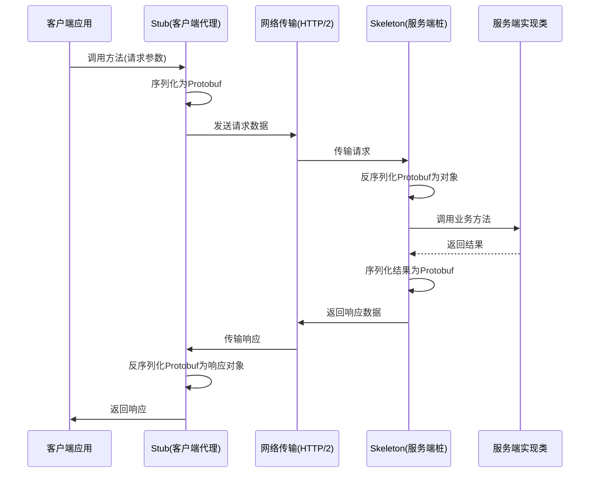

# gRPC

## 一次完整的调用流程概览



一次调用流程：

- Client Stub：客户端的Proxy代理对象，把方法调用信息序列化（Protobuf）成二进制形式通过HTTP/2发送到服务器
- Server Skeleton：负责将网络请求反序列化为真正的请求然后传给服务实现类，处理逻辑完成之后将返回的结果再次序列化为二进制形式，返回给客户端。
- Client Stub：收到返回结果将其反序列化后形成真正的调用结果。

## proto 文件

**定义了请求和响应消息的内容以及分别请求的方法**

- 定义消息结构（`message`）

- 定义服务接口（`service` + `rpc` 方法）


- 必须使用 **Protocol Buffers（Protobuf）** 作为 IDL，通过 `.proto` 文件定义服务接口、数据结构（消息类型）和方法参数 / 返回值。这是客户端与服务端一致的 “契约”，确保双方对通信格式的理解一致。
- 在 `.proto` 文件中通过 `service` 关键字定义服务，明确包含的 RPC 方法（如简单 RPC、流式 RPC 等），以及每个方法的输入（`request`）和输出（`response`）类型。
- 基于 `.proto` 文件，通过 gRPC 提供的代码生成工具（如 `protoc` 配合对应语言的插件）生成客户端 “存根（Stub）” 和服务器 “骨架（Skeleton）” 代码，简化跨语言调用的实现。

```protobuf
syntax = "proto3";

package example;

// 请求参数
message HelloRequest {
  string name = 1;
}

// 响应结果
message HelloResponse {
  string message = 1;
}

// 服务接口
service Greeter {
  rpc SayHello(HelloRequest) returns (HelloResponse);
}

```

使用Protoc和语言插件自动生成客户端Stub和服务端Skeleton代码，然后服务端继承生成的抽象类，实现服务方法，填充业务逻辑

## 生成代码

```xml
<plugin>
    <groupId>org.xolstice.maven.plugins</groupId>
    <artifactId>protobuf-maven-plugin</artifactId>
    <version>0.6.1</version>
    <configuration>
        <protocArtifact>com.google.protobuf:protoc:3.21.12:exe:${os.detected.classifier}</protocArtifact>
        <pluginId>grpc-java</pluginId>
        <pluginArtifact>io.grpc:protoc-gen-grpc-java:1.57.2:exe:${os.detected.classifier}</pluginArtifact>
    </configuration>
</plugin>

```

执行 `mvn compile` 会生成：

- `GreeterGrpc.GreeterImplBase`（服务端基类）
- `GreeterGrpc.GreeterBlockingStub` / `GreeterFutureStub` / `GreeterStub`（客户端）

### 其他依赖

在 Java 工程里使用 gRPC，一般要引入 3 类依赖：

1. **gRPC 核心库（运行时）**
2. **代码生成插件（protoc + gRPC Java 插件）**
3. **Protobuf 运行时**

- 必需：`grpc-netty-shaded` + `grpc-stub` + `grpc-protobuf` + `protobuf-java`
- 生成代码要有：`protobuf-maven-plugin` + `protoc-gen-grpc-java`
- 生产环境通常还会加 `grpc-services` 做健康检查

#### 核心依赖（运行时）

```xml
<properties>
    <maven.compiler.source>17</maven.compiler.source>
    <maven.compiler.target>17</maven.compiler.target>
    <project.build.sourceEncoding>UTF-8</project.build.sourceEncoding>
    <grpc.version>1.74.0</grpc.version>
    <protobuf.version>3.25.5</protobuf.version>
</properties>

<dependencies>
    <dependency>
        <groupId>io.grpc</groupId>
        <artifactId>grpc-netty-shaded</artifactId>
        <version>${grpc.version}</version>
        <scope>runtime</scope>
    </dependency>
    <dependency>
        <groupId>io.grpc</groupId>
        <artifactId>grpc-protobuf</artifactId>
        <version>${grpc.version}</version>
    </dependency>
    <dependency>
        <groupId>io.grpc</groupId>
        <artifactId>grpc-stub</artifactId>
        <version>${grpc.version}</version>
    </dependency>
    <dependency>
        <groupId>org.apache.tomcat</groupId>
        <artifactId>annotations-api</artifactId>
        <version>6.0.53</version>
        <scope>provided</scope>
    </dependency>
</dependencies>
```

#### 代码生成插件（Maven）

注意protoSourceRoot，proto文件一定要放在指定的位置，不然插件找不到位置。

```xml
<build>
    <extensions>
        <extension>
            <groupId>kr.motd.maven</groupId>
            <artifactId>os-maven-plugin</artifactId>
            <version>1.7.1</version>
        </extension>
    </extensions>
    <plugins>
        <plugin>
            <groupId>org.xolstice.maven.plugins</groupId>
            <artifactId>protobuf-maven-plugin</artifactId>
            <version>0.6.1</version>
            <configuration>
                <protoSourceRoot>${project.basedir}/src/main/resources</protoSourceRoot> <!-- proto文件目录 -->
                <protocArtifact>com.google.protobuf:protoc:${protobuf.version}:exe:${os.detected.classifier}</protocArtifact>
                <pluginId>grpc-java</pluginId>
                <pluginArtifact>io.grpc:protoc-gen-grpc-java:${grpc.version}:exe:${os.detected.classifier}</pluginArtifact>
            </configuration>
            <executions>
                <execution>
                    <goals>
                        <goal>compile</goal>
                        <goal>compile-custom</goal>
                    </goals>
                </execution>
            </executions>
        </plugin>
    </plugins>
</build>
```

> ⚠️ `os.detected.classifier` 依赖 `os-maven-plugin` 自动检测操作系统，否则你需要手动填 `windows-x86_64` / `linux-x86_64` 等。

#### 可选依赖（按需添加）

- **gRPC 服务健康检查**（K8s / 监控需要）

```xml
<dependency>
    <groupId>io.grpc</groupId>
    <artifactId>grpc-services</artifactId>
    <version>${grpc.version}</version>
</dependency>
```

- **安全（TLS/SSL）**

```xml
<dependency>
    <groupId>io.grpc</groupId>
    <artifactId>grpc-netty</artifactId>
    <version>${grpc.version}</version>
</dependency>
```

（和 `grpc-netty-shaded` 只能二选一）

## gRPC Server

### 填充业务逻辑

```python
public class GreeterServiceImpl extends GreeterGrpc.GreeterImplBase {
    @Override
    public void sayHello(HelloRequest req, StreamObserver<HelloResponse> responseObserver) {
        String result = "Hello, " + req.getName();
        HelloResponse reply = HelloResponse.newBuilder().setMessage(result).build();
        responseObserver.onNext(reply);
        responseObserver.onCompleted();
    }
}

```

### 启动gRPC服务

- 绑定服务实现类，监听端口

```java
public class GrpcServer {
    public static void main(String[] args) throws Exception {
        Server server = ServerBuilder.forPort(50051)
            .addService(new GreeterServiceImpl())
            .build()
            .start();
        System.out.println("Server started on port 50051");
        server.awaitTermination();
    }
}

```

**实践建议**：

- 放在 Spring Boot 中启动（通过 `@PostConstruct`）
- 配合 `health check`（比如 `grpc-health-probe`）用于 K8s 探针

## gRPC Client

创建 `Channel` → 创建 `Stub` → 调用 RPC

```java
public class GrpcClient {
    public static void main(String[] args) {
        ManagedChannel channel = ManagedChannelBuilder.forAddress("localhost", 50051)
            .usePlaintext()
            .build();

        GreeterGrpc.GreeterBlockingStub stub = GreeterGrpc.newBlockingStub(channel);

        HelloResponse response = stub.sayHello(
            HelloRequest.newBuilder().setName("Alice").build()
        );

        System.out.println(response.getMessage());
        channel.shutdown();
    }
}

```

## 最佳实践

- **连接管理**
  - 高并发建议使用**连接池**（例如 Netty ChannelPool）
  - 长连接重用，避免每次调用都 `new ManagedChannel`
- **错误重试**
  - gRPC 自带重试机制（需在客户端 `ServiceConfig` 配置）
  - 结合业务异常判断（不要无脑重试）
- **安全加密**
  - 内网可 `usePlaintext()`
  - 公网必须 TLS（`useTransportSecurity()`）
- **拦截器（Interceptor）**
  - 实现统一日志、鉴权、Tracing（OpenTelemetry）
  - 分客户端和服务端两种
- **流式通信**
  - 一元 RPC（Unary）
  - 服务端流（Server Streaming）
  - 客户端流（Client Streaming）
  - 双向流（Bidirectional Streaming）
  - 常用于**实时数据推送**或**长连接交互**
- **部署与可观测性**
  - K8s 部署时，用 readiness/liveness probe
  - Prometheus + gRPC Metrics 收集延迟、QPS